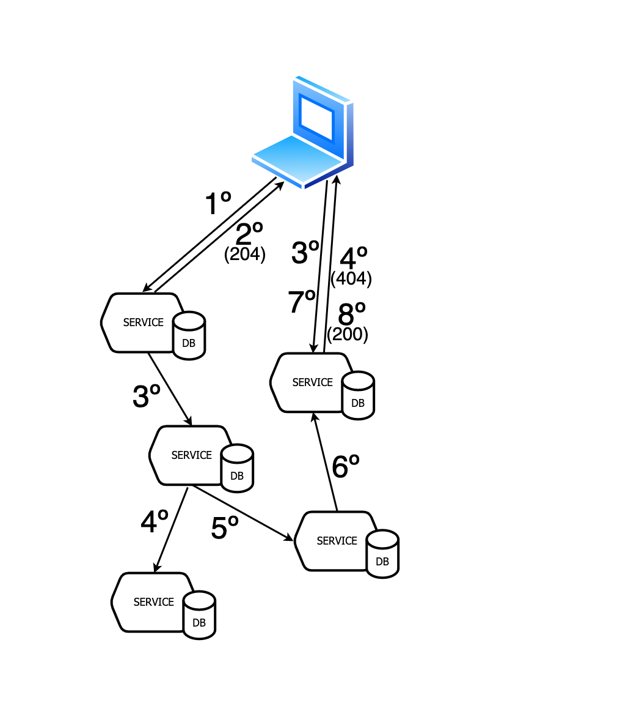

 

<!-- _class: centered -->
<!-- backgroundImage: url('./cover.png') -->

<!-- titulo y me presento y tutor-->
---

<!-- backgroundImage: url('./presentation_slide.png') -->

##### Miguel García Sanguino
15 años como developer
Frontend 70% Backend 30%
Software engineer en ING

<!-- 
Trabajo en ing, me han pagado el máster CLOUD APP
Esto es un trabajo de investigación, continuación del máster
 -->

---
<!-- backgroundImage: url('./intro_slide.png') -->
<!-- paginate: false -->
<!-- footer: Frontend vitaminized from the backend - Miguel García Sanguino -->

## Frontend vitaminized from the backend
Un front en un master de cloud apps ¿De que hago el TFM?

Procesos complicados ...
Multi respuestas ...
Asincronia ...
Actualizaciones ...
Modelos de datos ...
Relaciones entre squads ...
 
Trabajo de investigación

<!-- 
Contar anecdota de procesos asincronos que no llegaron a hacerse y otras...

Contar anecdota de modelos de datos, notificaciones...

-->

---

<!-- backgroundImage: url('./background.png') --> 

### Pains - modelos de datos
 
 
 
 
 
 
 
 
 
 
 
 
 
 
 

---

### Pains - respuestas asincronas

Proceso depende de otra acción humana

Solución: comunicación servidor - cliente

Long pooling, WebComponents, o ServerSentEvents, servicio con complejidad extra !~ funcional
 

---

### Pains - respuestas asincronas

Proceso depende de otros asincronos

Solución: espera? 204 y preguntar?

De nuevo pooling, WC o SSE, pero que servicio se queda con la conexión?

 

---

### Patron Backend for Frontend

Uno por cada tipo de cliente

Adapta el api a cada consumidor

Simplifica clientes

Elimina la sobrecarga de servicios

 

<!--
La idea es 1 por cada tipo de cliente

saga es un patron asegura consistencia

crea estructuras para caminos felices y marchas atras en caso de fallo

una muy usada, orquestacion y maquina de estados, pero acopla mucho

problemas en gobierno muchos equipos en empresas grandes

 --> 

---

### BFF : añadir un servicio solo para el front

Front recibe los datos que necesita,
cuando los necesita, desde el BFF,
en el formato que los necesita,
sin entorpecer a middle,
ni en el modelo,
ni con desarrollos extra

---

### Pains - transacciones

Antes teniamos transacciones ACID "simples"

Si tenemos multiples bases de datos? que hacermos?

  
  

---

### Pains - respuesta al front

Has creado el pedido ya?
Has creado el pedido ya?
Has creado el pedido ya?
Si
Has pedido la comida ya?
Has pedido la comida ya?
Has pedido la comida ya?
Si
Has reservado un rider ya?
Has reservado un rider ya?
...
 
<!--
Todos hemos visto cosas parecidas...
 --> 

---

### Patron Saga

- Transacción en microservicios
- 1 servicio - 1 transacción
- Si algo va mal rollback de todo
- Asegura Consistencia
- Orquestadas / Coreografiadas

  
  

<!--
Transaccion en MS se complican mucho

saga es un patron asegura consistencia

crea estructuras para caminos felices y marchas atras en caso de fallo

una muy usada, orquestacion y maquina de estados, pero acopla mucho

problemas en gobierno muchos equipos en empresas grandes

 --> 

 ---

### Saga Orquestada

Orquestador llama y espera
Sencilla en procesos sincronos
Acoplamiento de servicios
\+ dificil resiliencia y escalabilidad
 

### Saga Coreografiada

Servicios reciben y envian eventos
Desacoplamiento de servicios
\+ facil resiliencia y escalabilidad
 

 
<!--
Orquestacion es acoplada y 1 unico punto de dolor
Decide el order el orquestador

Coreografiada desacoplada, control distribuido
Orden se decide en eventos
Gobierno de equipos es mas sencillo

 --> 

 ---

### Objetivos

Servicios desacoplados
Respuestas multiples asincronas
El middleware no se tiene que preocupar del front
Escalables y resilientes
Desacoplamientos de squads, no solo técnico

 
 
 
<!-- 
Facil, no?
Microservicios y websockets
A quien se conecta el front?
Se tiene que preocupar el squad del servicio de restaurantes de mandar al front un mensaje?
--> 

---

##### Caso de uso

Pedido de comida online

- Asincrono

- Depende de servicios externos

- Actualizaciones multiples

- Transacciones

- Modelos diferentes

<!-- 
El front hace 1 llamada

multiples respuestas

diferentes momento
--> 

---
<!-- _class: centered -->

##### Caso de uso

<!-- los pasos happy path --> 

---

 ##### Caso de uso

Saga middleware

Cada paso un servicio

Rollback en caso de fallo

Informar al usuario en cada paso

<!-- completada vs cancelada --> 

---

 ##### Caso de uso

BFF consume los mismo eventos

Cada paso el BFF informa al front

Middleware no hace nada especial

<!-- completada vs cancelada --> 
---

<!-- _class: split -->

### Objetivos:

Servicios desacoplados
Respuestas multiples asincronas
El middleware no se tiene que preocupar del front
Escalables y resilientes
Squads Desacoplados, no solo técnico

#### Middleware
- servicios desacoplados
- saga coreografiada, sin estados
- comunicacion por eventos
- escalables y resilientes

#### Frontend
- pervertir patrón BFF
- consume de los eventos
- independiente y asíncrono
- notificaciones online / offline

<!-- MIDDLE  

 desacoplados -> entre ellos y tambien de los consumidores  

 Coreografia -> desconocer la transaccion, indepencida en desarrollo y ciclo de vida, codigo y equipos  

 Sin maquina de estados, por quitar la coreografia, simplificar  

 Eventos, porque da independencia, capacidad de cambiar el orden de la saga, meter mas pasos  

 Por experiencias paadas, una transaccion en MS se complican mucho 
 --> 

<!-- FRONT 

No queremos que el middleware se tenga que preocupar en informarnos ni que consumidores tiene, ni de que modelo de datos necesita cada uno

comunicacion independiente y asincrona 

propone un BFF consumira eventos, escucha sin molestar 

Por experiencias paadas, una transaccion en MS se complican mucho 

Y todas las buenas practicas que hemos aprendido en el master --> 

---

## Arquitectura

- ingress
- front
- servicios + bases de datos
- externals ~ Mocks
- notificaciones ~ Mocks
- Zookeeper y kafka

<!-- También están incluidos kowl y Kafka-ui -->
---

## Stack

- Kubernetes
- Kafka
- Mongo DB
- Nodejs
- kafkajs
- express
- mongoose
- Rollup como builder
- Lit
- Kor-ui

 
 

---

## Idempotencia

Marcamos el offset después de enviar la salida.
Deben ser idempotentes:

- todos los servicios de la saga
- los servicios externos
- los rollback de la saga

<!-- 
llevas 6 min!!!

hablar de base service -->
---

## Estáticos y BFF juntos

El contendor front lleva dentro el servicio BFF y los estáticos
- Los desarrolla el equipo front a sus necesidades
- Agiliza el CI/CD y el testing
- Decide si envía online / offline

---
### Flujo middleware

- único punto de entrada, independiente del consumidor
- servicios no tienen conexiones entre ellos
- Order genera el orderId y audita
- OrderId como correlation id
- Variables de entorno cambiar orden de la saga
- resiliencia y escalabilidad

<!-- cada servicio su bbdd

Orderid correlationId

** 
 -->

---

### Flujo Frontend

- backend for frontend
- sin bbdd
- reenvía eventos de middle a front
- convierte eventos en notificaciones
- adapta modelos

---

## Web Sockets vs Server Sent Events vs pooling

- En los 3 casos se queda una conexión abierta, tiempos muy similares
- Pooling descartado por dejar 1 hilo y porque a los 30 seg se repite la petición
- Server Sent Events es REST
- Web Sockets permite bidireccionalidad y datos complejos

<!--   -->
---

# DEMO TIME!

---

## Escalabilidad y resiliencia

Servicios idempotentes, 1 evento 1 instancia.

BFF 1 usuario 1 instancia, 1 evento a todas las instancias.

Si instancia cae, front reconecta

Fallback con notificaciones

---

## E2E test

Test E2E en cypress con gherkin.

Cada test configura el api externals: tiempo y response code
(banco, restaurante, rider).

Tests con el usuario online y offline, check de notificaciones.

Tests comprueban el rollback en las bbdd.

> [reportes mocha y cucumber](http://tfm.sanguino.io/)

--- 

<!-- _class: centered -->
## E2E test video
<video width="83%" controls autoplay>
    <source src="e2e.mp4" type="video/mp4">
</video>

---

## Conclusiones
Objetivos conseguidos:

- Saga coreografiada con eventos en kafka
- Servicios idempotentes, resilientes, escalables e independientes.
- El frontend consume actualizaciones sin afectar a los servicios
- Las piezas y la arquitectura son muy simples, y muy mantenible
- El patron BFF esta pervertido pero es fundamental
- Los squads apenas tienen dependencias entre ellos más haya del contrato de los eventos
- SSE gana sobre WC y Pooling, aunque por poco

<!-- habria que hacer test en el BFF de recursos consumidos -->
--- 
## Otros casos de uso para el BFF

- Actualizar datos cuando llegan, tanto eventos como en bbdd
  - Usuario actualiza sus datos en el momento
  - Evita la sobrecarga del middleware
  - Evita recargas o gestion de cache
  - Desacoplamiento middle - frontend

---

<!-- _class: centered -->

 

 
 
 
 
 

## GRACIAS!

---

---
### Kafka Mongo connect

#### Pros

envía eventos al persistir en bbdd

simplifica idempotencia

#### Cons
un servico más

obliga a tener mongo en replica set de al menos 3 instancias

> Finalmente se descarta, no merece la pena

 

<!-- --> se planteo debezium, pero se uso connect

